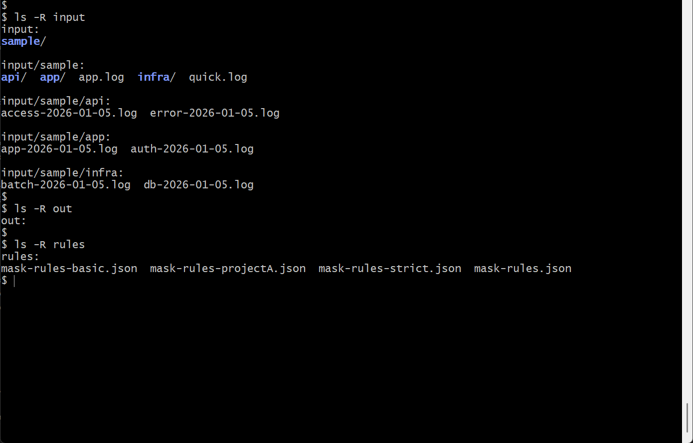
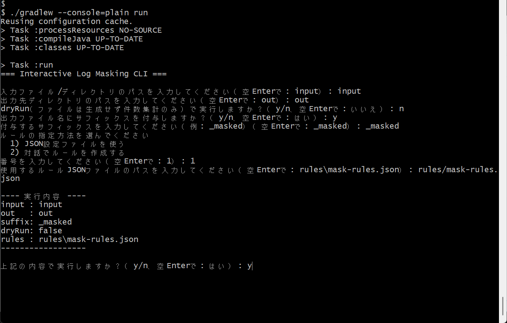
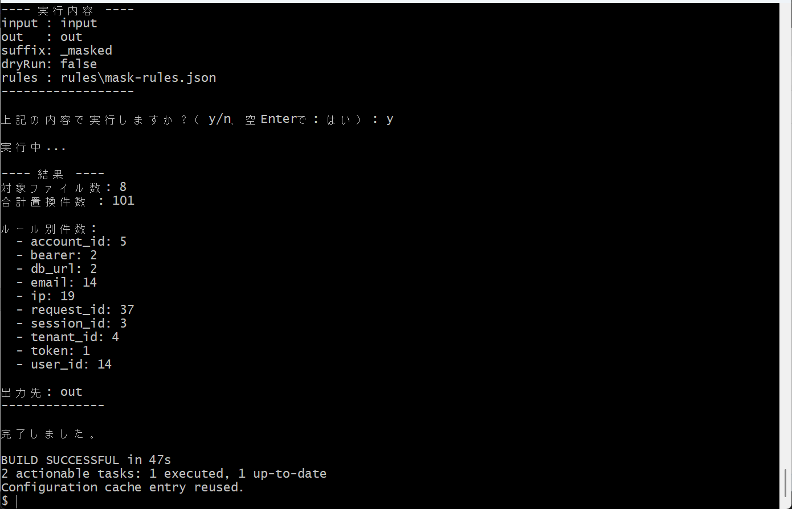
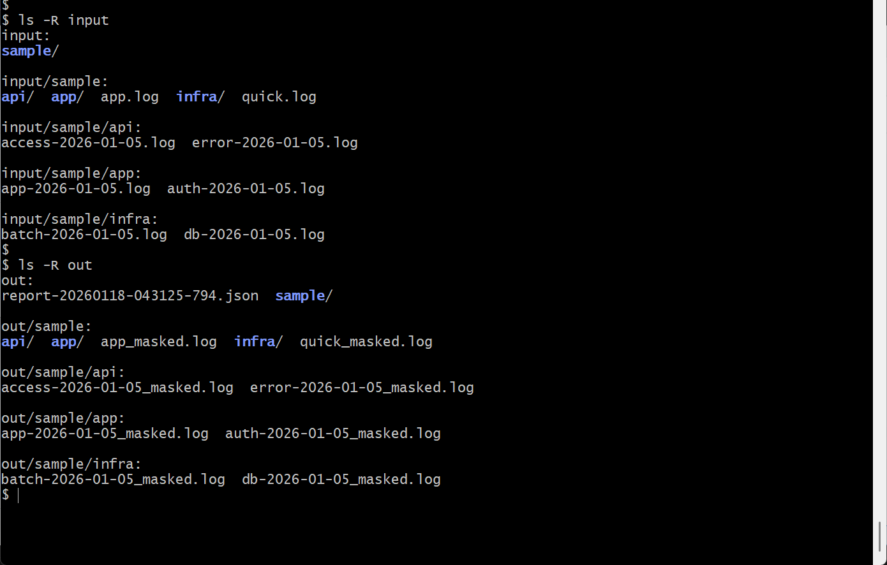
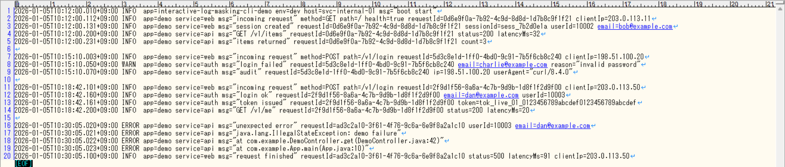
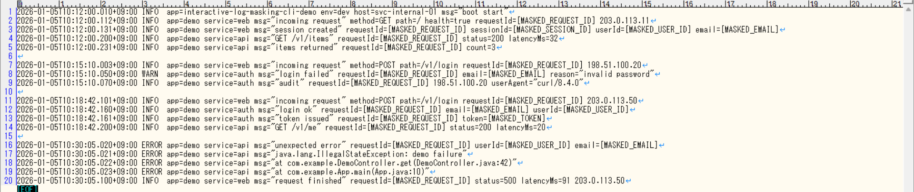
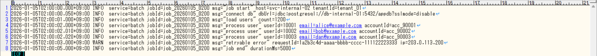
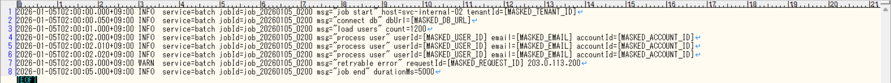

# Interactive Log Masking CLI

<p>
  <a href="https://github.com/seiya-matsuoka/interactive-log-masking-cli/releases/latest">
    
  </a>
</p>

<p>
  
  
  
  
  
</p>

ログ/テキストをルールに従ってマスキング（置換）し、`out/` 配下に出力する **対話型 CLI ツール**です。  
dryRun（件数集計のみ）にも対応し、実行結果レポート（`out/report-*.json`）を出力します。

---

## リリース（ダウンロード）

[](https://github.com/seiya-matsuoka/interactive-log-masking-cli/releases/latest)

- [`最新版URL`](https://github.com/seiya-matsuoka/interactive-log-masking-cli/releases/latest)：`https://github.com/seiya-matsuoka/interactive-log-masking-cli/releases/latest`

---

## スクリーンショット

1. 実行前の `input/`, `out/`, `rules/` の内容
   

2. コマンド起動から対話の流れと実行計画の表示
   

3. 実行後の結果表示
   

4. 実行後の `input/`, `out/`, `rules/` の内容
   

5. マスキング前後（実行前後）のサンプルログの比較 ①

- マスキング前（実行前）
  

- マスキング後（実行後）
  

6. マスキング前後（実行前後）のサンプルログの比較 ②

- マスキング前（実行前）
  

- マスキング後（実行後）
  

---

## 主な機能

- **入力**：単一ファイル / ディレクトリ再帰
- **ルール指定**：JSON 設定ファイル / 対話で作成（必要なら保存）
- **出力**：`out/` 配下に構造維持で出力、ファイル名サフィックス付与（例：`_masked`）
- **dryRun**：件数集計のみ（ファイル生成なし）
- **レポート**：`out/report-YYYYMMDD-HHMMSS-SSS.json` を毎回新規出力（dryRun でも出力）

---

## 前提条件

- Java 21（実行環境）
- **Release 配布物（distZip）で使う場合**：Gradle は不要です（依存 JAR 同梱のため）
- リポジトリを直接実行する場合: Gradle

---

## クイックスタート（Release 配布物）

1. Releases から zip をダウンロードして展開

2. 起動（bin 配下のスクリプト）

```bash
# macOS / Linux
./bin/interactive-log-masking-cli

# Windows（PowerShell / cmd）
.\bin\interactive-log-masking-cli.bat
```

3. 対話に従って入力し、実行計画（RunPlan）を確認して実行

---

## リポジトリから実行（開発者向け）

対話表示が崩れないよう、`--console=plain` 付きで起動するのを推奨します。

```bash
# macOS / Linux
./gradlew --console=plain run

# Windows（PowerShell）
.\gradlew --console=plain run
```

テスト：

```bash
./gradlew test
```

---

## 使い方（対話フロー概要）

対話で以下を順に確定し、最後に実行計画を表示して確認後に処理を開始します。

- 入力パス（ファイル or ディレクトリ）
- 出力先ディレクトリ（out 配下）
- dryRun（件数集計のみ）にするか
- 出力ファイル名にサフィックスを付与するか / サフィックス文字列
- ルール指定方法（JSON / 対話作成）

---

## ルール JSON（例）

例：メールアドレスをマスキング

```json
{
  "version": 1,
  "rules": [
    {
      "id": "email",
      "name": "メールアドレスをマスク",
      "enabled": true,
      "pattern": "[A-Za-z0-9._%+-]+@[A-Za-z0-9.-]+\\.[A-Za-z]{2,}",
      "replacement": "[MASKED_EMAIL]",
      "flags": ["CASE_INSENSITIVE"]
    }
  ]
}
```

---

## 出力について

- 通常実行：`out/` 配下にマスキング済みファイルを生成（ディレクトリ入力時は構造維持）
- dryRun：ファイルは生成しない（件数のみ集計）
- 通常/dryRun 共通：`out/report-YYYYMMDD-HHMMSS-SSS.json` を出力

---

## サンプルデータについて（安全性）

本リポジトリに同梱している `input/sample/` のログ、および `rules/` 配下のルールは、**デモ用に作成した架空のデータ**です。  
実在する個人情報・機密情報・実ログ由来の内容は含んでいません。

実ログに適用する場合は、運用上の安全のため以下を推奨します。

- 元ログはコピーを使う（本ツールは入力ファイルを変更しませんが、安全のため）
- まず dryRun で件数確認してから通常実行する

---

## 技術スタック

- Java 21
- Gradle（Gradle Wrapper）
- Jackson（JSON の読み書き）
- JUnit 5（テスト）
- GitHub Releases（distZip で配布）

---

## ドキュメント

ドキュメントは `/docs` にまとめています。

- 使い方：[`docs/01_usage.md`](docs/01_usage.md)
- 仕様まとめ：[`docs/02_spec-summary.md`](docs/02_spec-summary.md)
- 設計：[`docs/03-architecture.md`](docs/03-architecture.md)
